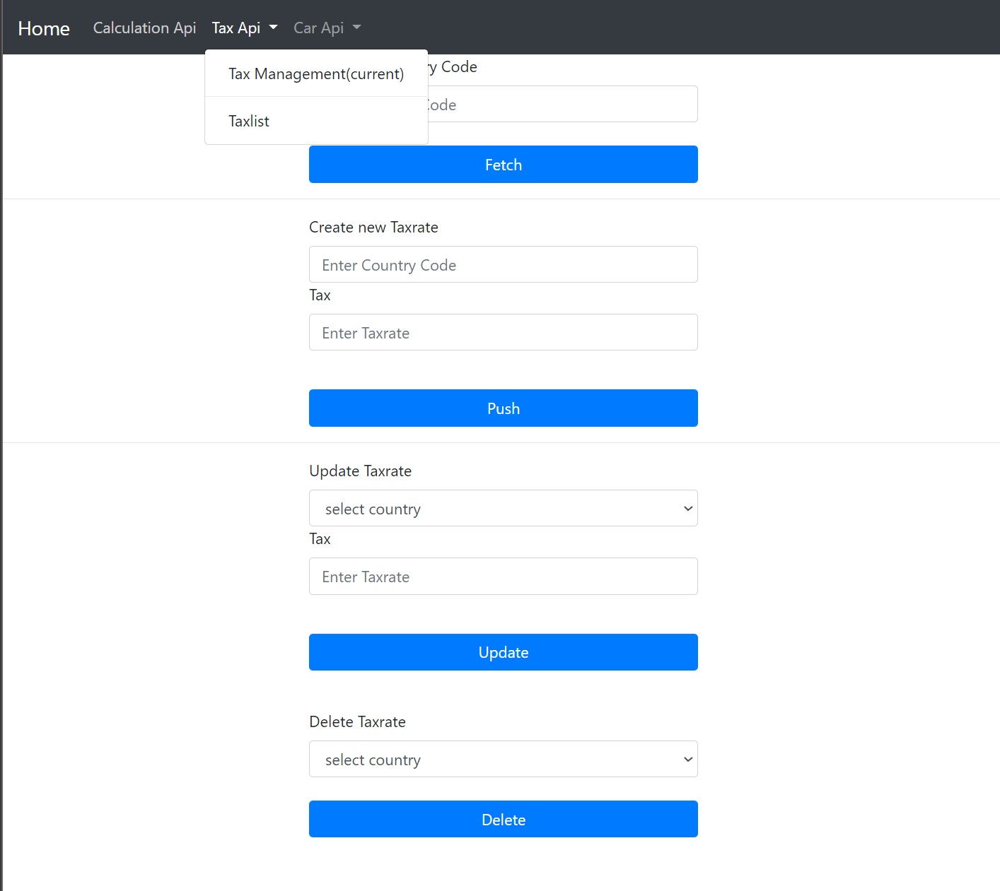
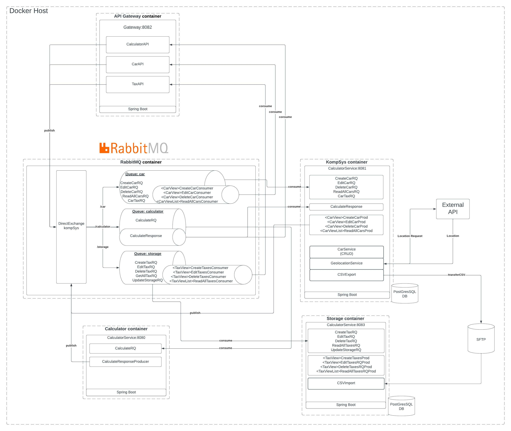
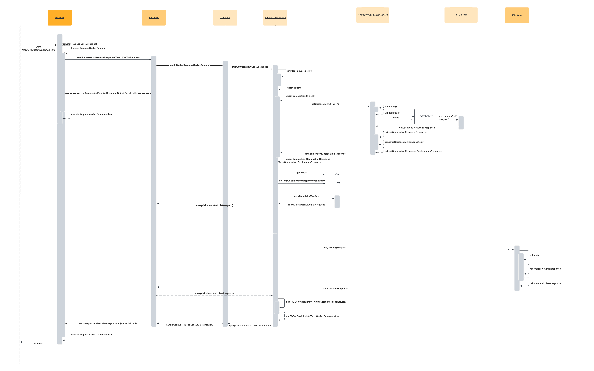

[![Contributors][contributors-shield]][contributors-url]
[![Forks][forks-shield]][forks-url]
[![Stargazers][stars-shield]][stars-url]
[![Issues][issues-shield]][issues-url]
[![MIT License][license-shield]][license-url]
[![LinkedIn][linkedin-shield]][linkedin-url]


<!-- PROJECT LOGO -->
<br />
<div align="center">
<h1 align="center">KompSys</h1>

  <p align="center">
    Car and sales tax microservice tool
    <br />
    ·
    <a href="https://github.com/dergil/KompSys/issues">Report Bug</a>
    ·
    <a href="https://github.com/dergil/KompSys/issues">Request Feature</a>
  </p>
</div>


<!-- TABLE OF CONTENTS -->
<details>
  <summary>Table of Contents</summary>
  <ol>
    <li>
      <a href="#about-the-project">About The Project</a>
      <ul>
        <li><a href="#built-with">Built With</a></li>
      </ul>
    </li>
    <li>
      <a href="#getting-started">Getting Started</a>
      <ul>
        <li><a href="#prerequisites">Prerequisites</a></li>
        <li><a href="#installation">Installation</a></li>
      </ul>
    </li>
    <li><a href="#usage">Usage</a></li>
    <li><a href="#roadmap">Roadmap</a></li>
    <li><a href="#contributing">Contributing</a></li>
    <li><a href="#license">License</a></li>
    <li><a href="#contact">Contact</a></li>
    <li><a href="#acknowledgments">Acknowledgments</a></li>
  </ol>
</details>


<!-- ABOUT THE PROJECT -->

## About The Project

This project provides an administration for cars and sales tax rates. 
The sales tax rates of products can be calculated based on geolocation.
Data is automatically backed up, the back-up frequency depends on the interaction volume.
The architecture is microservice based, the application is ready for deployment in the cloud.



### Architecture

### Sequence for Calling the calculation API on a Car


<p align="right">(<a href="#top">back to top</a>)</p>

### Built With

* [Spring Boot](https://spring.io/)
* [Maven](https://maven.apache.org/)
* [Docker](https://docker.com/)
* [Docker SFTP server](https://github.com/atmoz/sftp)
* [Rabbit MQ](https://www.rabbitmq.com/)
* [Swagger](https://swagger.io/)
* [Micrometer](https://micrometer.io/)
* [Testcontainers](https://www.testcontainers.org/)
* [JUnit 5](https://junit.org/junit5/)
* [Super CSV](http://super-csv.github.io/)
* [Lombok](https://projectlombok.org/)
* [Bootstrap](https://getbootstrap.com/)

<p align="right">(<a href="#top">back to top</a>)</p>


<!-- GETTING STARTED -->

## Getting Started

To get a local copy up and running follow these simple example steps.

### Prerequisites

For this project to run you need to have Docker installed. For instructions follow <br>[Docker - Get Started](https://www.docker.com/get-started/) 

### Installation

1. Clone the repo
   ```sh
   git clone https://github.com/dergil/KompSys
   ```
2. Install Dependencies with Maven
   ```sh
   mvn clean package -DskipTests 'KBE_microservices'
   ```
3. Build and run containers with docker-compose
   ```sh
   docker-compose up -d
   ```

<p align="right">(<a href="#top">back to top</a>)</p>


<!-- USAGE EXAMPLES -->

## Usage

You can access the APIs through the Frontend on http://localhost:8085/ or create your own request directly on http://localhost:8082/api/v1/ and the corresponding endpoints.
Available endpoints are:
- /car
- /car/all
- /tax
- /tax/all

For more examples, please refer to the swagger documentation found on http://localhost:8082/swagger-ui.html_

<p align="right">(<a href="#top">back to top</a>)</p>

<!-- CONTRIBUTING -->

## Contributing

Contributions are what make the open source community such an amazing place to learn, inspire, and create. Any
contributions you make are **greatly appreciated**.

If you have a suggestion that would make this better, please fork the repo and create a pull request. You can also
simply open an issue with the tag "enhancement". Don't forget to give the project a star! Thanks again!

1. Fork the Project
2. Create your Feature Branch (`git checkout -b feature/AmazingFeature`)
3. Commit your Changes (`git commit -m 'Add some AmazingFeature'`)
4. Push to the Branch (`git push origin feature/AmazingFeature`)
5. Open a Pull Request

<p align="right">(<a href="#top">back to top</a>)</p>


<!-- LICENSE -->

## License

Distributed under the MIT License. See `LICENSE.txt` for more information.

<p align="right">(<a href="#top">back to top</a>)</p>


<!-- CONTACT -->

## Contact

Project Link: [https://github.com/dergil/KompSys](https://github.com/dergil/KompSys)

<p align="right">(<a href="#top">back to top</a>)</p>


<!-- MARKDOWN LINKS & IMAGES -->
<!-- https://www.markdownguide.org/basic-syntax/#reference-style-links -->

[contributors-shield]: https://img.shields.io/github/contributors/dergil/KompSys.svg?style=for-the-badge

[contributors-url]: https://github.com/dergil/KompSys/graphs/contributors

[forks-shield]: https://img.shields.io/github/forks/dergil/KompSys.svg?style=for-the-badge

[forks-url]: https://github.com/dergil/KompSys/network/members

[stars-shield]: https://img.shields.io/github/stars/dergil/KompSys.svg?style=for-the-badge

[stars-url]: https://github.com/dergil/KompSys/stargazers

[issues-shield]: https://img.shields.io/github/issues/dergil/KompSys.svg?style=for-the-badge

[issues-url]: https://github.com/dergil/KompSys/issues

[license-shield]: https://img.shields.io/github/license/dergil/KompSys.svg?style=for-the-badge

[license-url]: https://github.com/dergil/KompSys/LICENSE.txt

[linkedin-shield]: https://img.shields.io/badge/-LinkedIn-black.svg?style=for-the-badge&logo=linkedin&colorB=555

[linkedin-url]: https://linkedin.com/in/philipp-dahlke

[product-screenshot]: images/screenshot.png
